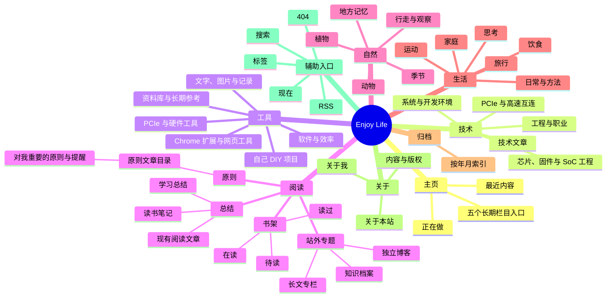

# 网站内容思维导图

## 全站结构

## 内容唯一归属规则

一个内容只有一个正文归属，其他位置只能作为索引或链接，不复制正文。

| 内容类型 | 唯一正文归属 | 允许出现的其他位置 |
| --- | --- | --- |
| 阅读文章、读书笔记 | `阅读 / 总结` | 首页、归档、标签和搜索结果只显示索引 |
| 书籍 | `阅读 / 书架` | 总结文章可以提到书名，但不复制书架简介 |
| 个人原则 | `阅读 / 原则` | 其他页面只允许链接，不摘抄成第二份正文 |
| 站外网站 | `阅读 / 站外专题` | 搜索结果只显示索引 |
| 技术文章 | `技术 / 技术文章` 或对应技术专题 | 首页、归档、标签和搜索结果只显示索引 |
| 工具 | `工具` 下的唯一分类 | 相关文章只链接工具，不重复工具说明 |
| 自然观察 | `自然` 下的唯一分类 | 相关文章只链接观察条目 |
| 生活记录 | `生活` 下的唯一分类 | 首页、归档、标签和搜索结果只显示索引 |

## 本次重复内容盘查

- 阅读首页原先再次展示“最近阅读文章”，与“阅读文章”二级页重复；已移除，首页只保留四个目录入口。
- “阅读文章”改名为“总结”，现有阅读文章继续以这里作为唯一正文归属。
- 书架原先通过书目直接链接对应文章，并显示作者和日期；已收敛为书名与一句简介，按状态分组，正文仍只存在于“总结”。
- “我翻译的书”“我写的书”目前只有占位说明，没有独立内容；已退出公开信息架构，旧地址统一重定向到书架。
- “原则”栏目页只显示文章索引；正文只保存在 `src/content/writing/2026-07-13-personal-principles-and-reminders.md`。
- 归档、标签、搜索和首页属于索引层，可以指向内容，但不得保存第二份正文。

## 后续新增内容检查

1. 先确定唯一正文归属，再创建文件。
2. 已有正文只增加链接，不复制粘贴到另一个栏目。
3. 同一本书在书架只保留一句简介；长篇读书内容进入“总结”。
4. 同一工具只属于一个工具分类；跨栏目关系用链接表达。
5. 发布前检查标题相同、正文相似和旧路由残留。
